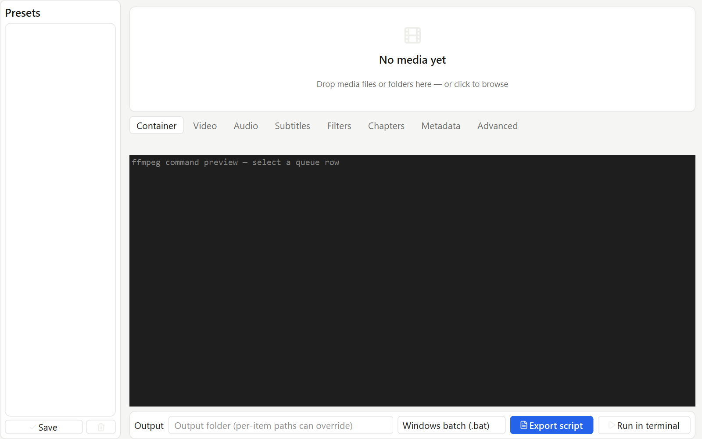
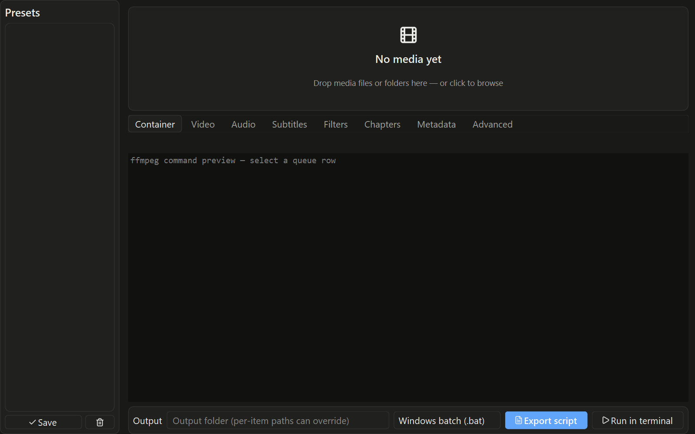

<p align="center">
  
</p>

<h1 align="center">ffgui</h1>

<p align="center">
  A native desktop GUI for building FFmpeg commands and exporting runnable scripts.
</p>

<p align="center">
  <a href="https://github.com/RoyCoding8/FFmpeg-GUI/actions/workflows/ci.yml"></a>
  
  
  <a href="LICENSE"></a>
</p>

<p align="center">
  <a href="#get-started"></a>
  <a href="https://github.com/RoyCoding8/FFmpeg-GUI"></a>
  <a href="https://github.com/RoyCoding8/FFmpeg-GUI/issues"></a>
</p>

ffgui is a PySide6 desktop application that builds FFmpeg commands from a media queue and exports runnable `.bat` and `.sh` scripts. It does not run FFmpeg during normal editing. The optional **Run in terminal** action launches an exported script in a detached terminal.

> **Bring your own FFmpeg.** ffgui discovers the FFmpeg build you provide or lets you locate it. FFmpeg is never bundled with this project.

## What you can do

<table>
  <tr>
    <td width="50%" valign="top">
      
      <br><strong>Basic</strong>
      <br>Add media, choose a container and codecs, trim clips, copy streams, and export a script.
    </td>
    <td width="50%" valign="top">
      
      <br><strong>Advanced</strong>
      <br>Set rate control, presets, filters, subtitles, chapters, and two-pass encoding options.
    </td>
  </tr>
  <tr>
    <td width="50%" valign="top">
      
      <br><strong>Expert</strong>
      <br>Work with the AVOptions exposed by the FFmpeg build detected on your machine.
    </td>
    <td width="50%" valign="top">
      
      <br><strong>Review before export</strong>
      <br>Inspect the generated command, choose one script per queue or one script for the full queue, and keep provenance in the exported file.
    </td>
  </tr>
</table>

## See the workflow

The workspace combines a presets sidebar, media queue, configuration tabs, command preview, and export controls in one window.

<table>
  <tr>
    <td></td>
    <td></td>
  </tr>
  <tr>
    <td colspan="2" align="center"><em>Light and dark themes</em></td>
  </tr>
</table>

## How it works

1. Add files or folders to the media queue.
2. Choose a workflow tier and set the options you need.
3. Review the generated FFmpeg command.
4. Export a Windows batch script or a POSIX shell script.

The export layer quotes arguments for each shell, embeds sidecar files when needed, and records the generator, FFmpeg version hash, UTC date, and job summary in the script header.

## Get started

Install Python 3.12 or newer, `uv`, and an FFmpeg build. Make FFmpeg available to ffgui through your system path or the application's file picker.

```sh
uv sync
uv run ffgui
```

On Windows, `run.bat` wraps the same command. On Linux and macOS, `run.sh` does the same.

## Development

```sh
uv run pytest tests/ -q
uv run ruff check src tests
uv run python scripts/check_readme.py
```

The project uses the `fftui` core for the `Job` model, command builder, capability index, and option validator.

## License

ffgui is available under the [Apache License 2.0](LICENSE). See [THIRD_PARTY.md](THIRD_PARTY.md) for PySide6, Lucide, PyYAML, pytest, Ruff, and FFmpeg notices.
